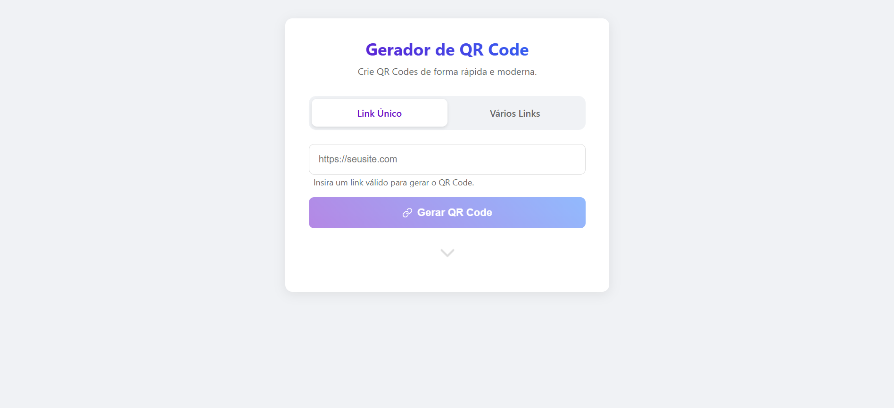
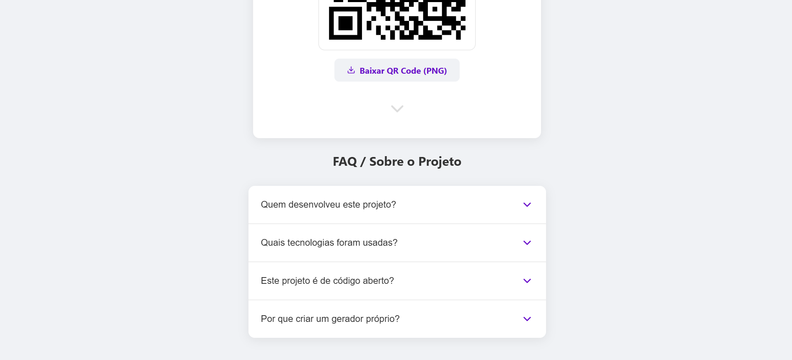
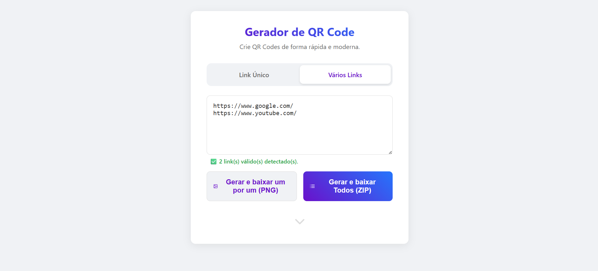

# 🚀 Gerador de QR Code Moderno


Um gerador de QR Code rápido, moderno e de código aberto, construído com React e Vite. Crie QR Codes para links únicos ou em massa, com opções de download flexíveis e uma interface limpa e sem anúncios.

**✨ [Acesse a versão ao vivo aqui!](https://lucasgontijo13.github.io/GeradorQRCode/)**

---

### 📸 Galeria do Projeto

| Tela Inicial Intuitiva | Geração de QR Code Único |
| :---: | :---: |
|  |  |
| **Seção de FAQ e Detalhes** | **Geração em Lote com Opções** |
|  |  |

---

## 🎯 Sobre o Projeto

Este projeto foi criado para resolver um problema comum: a maioria dos geradores de QR Code online são lentos, poluídos com anúncios ou cobram por funcionalidades básicas. O objetivo foi desenvolver uma alternativa 100% gratuita, de alta performance e de código aberto, que oferece uma experiência de usuário agradável e funcionalidades úteis tanto para usuários casuais quanto para quem precisa gerar códigos em massa.

---

## ✨ Funcionalidades Principais

* **Dois Modos de Geração:**
    * **Link Único:** Validação em tempo real para garantir que apenas links válidos sejam processados.
    * **Vários Links:** Cole uma lista de links para gerar múltiplos QR Codes de uma só vez.
* **Downloads Flexíveis:**
    * Baixe cada QR Code como uma imagem `.png` individualmente.
    * Baixe todos os QR Codes de uma vez em um único pacote `.zip`.
* **Alta Resolução:** Todos os QR Codes são gerados em alta qualidade, ideais para impressão e uso digital.
* **Interface Intuitiva:** Design moderno e responsivo, focado na simplicidade e na experiência do usuário.
* **Feedback em Tempo Real:** A interface informa o usuário sobre a validade dos links e o número de QR Codes a serem gerados.
* **Seção de FAQ Interativa:** Uma seção "Sobre" com um acordeão elegante para explicar o projeto.
* **Interações Modernas:** Indicador de rolagem animado com funcionalidade de clique para navegação suave.

---

## 🛠️ Tecnologias Utilizadas

* **Frontend:** [React](https://react.dev/)
* **Build Tool:** [Vite](https://vitejs.dev/)
* **Geração de QR Code:** [qrcode](https://www.npmjs.com/package/qrcode)
* **Compressão de Arquivos:** [jszip](https://www.npmjs.com/package/jszip)
* **Ícones:** [React Icons](https://react-icons.github.io/react-icons/)
* **Estilização:** CSS Puro com Variáveis
* **Hospagem:** [GitHub Pages](https://pages.github.com/)

---

## 🚀 Como Executar o Projeto Localmente

Para rodar este projeto na sua máquina, siga os passos abaixo.

### Pré-requisitos
* [Node.js](https://nodejs.org/) (versão 18 ou superior)
* [Git](https://git-scm.com/)

### Instalação

1.  **Clone o repositório:**
    ```bash
    git clone [https://github.com/lucasgontijo13/GeradorQRCode.git](https://github.com/lucasgontijo13/GeradorQRCode.git)
    ```

2.  **Navegue até a pasta do projeto:**
    ```bash
    cd GeradorQRCode
    ```

3.  **Instale as dependências:**
    ```bash
    npm install
    ```

4.  **Inicie o servidor de desenvolvimento:**
    ```bash
    npm run dev
    ```
    Agora, abra [http://localhost:5173](http://localhost:5173) no seu navegador para ver o projeto rodando.

---

## 🌐 Publicação (Deploy)

Este projeto está configurado para ser publicado facilmente no GitHub Pages.

1.  **Configure a base no `vite.config.js`:**
    Certifique-se de que a propriedade `base` corresponde ao nome do seu repositório.
    ```javascript
    // vite.config.js
    export default {
      // ...
      base: '/GeradorQRCode/',
    }
    ```

2.  **Execute o script de deploy:**
    Este comando irá construir o projeto e enviá-lo para a branch `gh-pages`.
    ```bash
    npm run deploy
    ```

3.  **Ative o GitHub Pages:**
    Nas configurações do seu repositório, vá em "Settings" > "Pages" e configure a fonte de publicação para a branch `gh-pages`.

---

## 👨‍💻 Autor

**Lucas Gontijo**

* **GitHub:** [@lucasgontijo13](https://github.com/lucasgontijo13)
* **LinkedIn:** [Lucas Gontijo](https://www.linkedin.com/in/lucas-gontijo-693a90229/)

---

## 📄 Licença

Este projeto está sob a licença MIT. Veja o arquivo [LICENSE](LICENSE) para mais detalhes.
